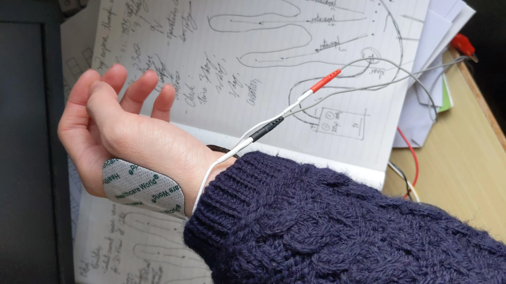

+++
date = '2024-06-05T21:37:17Z'
draft = false
title = 'Attempting to cure my eczema by: electrical shock'
disableToc = true
tags = ['Medicine', 'Eczema']
series = 'Eczema'
+++

For the past 10 years or so, I have been suffering from moderate
eczema. As anyone with eczema would know, this is incredibly
irritating to deal with, and practically impossible to treat. 

But we can try. So with the topical corticosteroids prescribed by my
doctor only serving to temporarily quell the condition, with a risk of
withdrawal syndrome, I elected to look for other solutions. 

Helge Bjørnå and Birger Kaada (1987) describe an experimental
treatment by transcutaneous electrical nerve stimulation (TENS). These
are available to consumers as a TENS unit, which is a little box with
dials that can control the strength and frequency of electrical pulses
sent to pads attached to your skin. This was intended to improve
circulation in the skin and thus promote healing and relief of
itching. After 2 years, they observed significant improvement in both,
though this was only tested in a singular patient. 

So I decided it might be fun to try it out myself, and so for the past
few months I have been applying electrical pulses to my hand twice a
day. So far there has been no noticeable improvement, however I will
report back results once a year has passed. 

