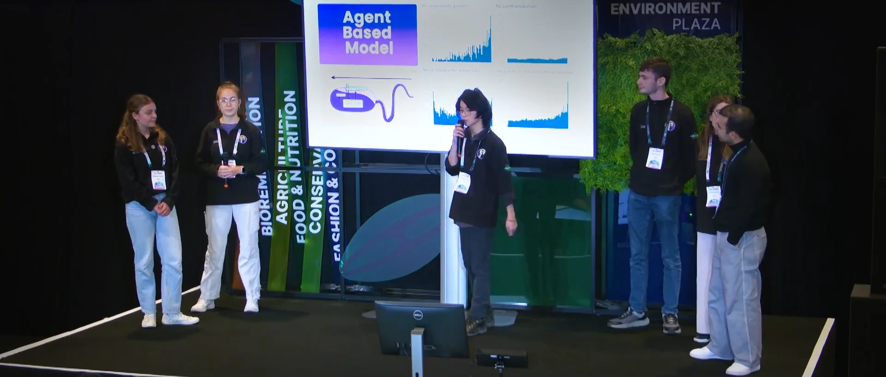

+++
date = '2025-02-07T17:48:38Z'
draft = false
title = 'Warwick iGEM 2024: moving metal with bacteria'
disableToc = false
series = 'University'
tags = ['Synthetic Biology', 'iGEM', 'Warwick', 'Research']
+++

From February to October 2024, I competed in the [international
Genetically Engineered Machines (iGEM)
competition](https://competition.igem.org/)—where competitors
developed engineered biological solutions for a variety of problem
spaces.

I was a member of the 2024 University of Warwick team,
[BEACON](https://2024.igem.wiki/warwick), working together to engineer
bacteria with the abilities to scavenge for rare earth metals, then to
transport them to a singular point for collection to be recycled. We
were one of 210 teams[^1] to be awarded a gold medal at the Paris
Jamboree.

This was an incredible experience, and one that I would recommend
anyone interested in synthetic/engineering biology to undertake. To
watch your team's idea go from nothing to a working, real physical
thing, whilst meeting so many other passionate, brilliant people is a
rare and precious opportunity.

## Project selection
The selection of team members was managed by our supervisors (Dr
Fabrizio Alberti and Dr Alexander Darlington), involving an initial
application stage, individual presentation, and group interview. 

The task was to present an area of synthetic biology you were
passionate about, and a potential synbio solution for the local
area. I gave my presentation on biological computers[^2], and
potential diagnostics for infected salmon in fish farms[^3]. We were
then randomly assigned groups and made to perform a group presentation
on one of the solutions anyone had presented.



Being the double-A Aaron I am, I presented first—which honestly may
have saved me. Watching everyone else's beautifully crafted,
enthusiastic and confident presentations was more than a little
demoralising. I began to think it would be impossible to be chosen
over the others. This was still only a few months into my first-year,
straight out of sixth form, so back then my public speaking skills
were ...less than perfect.

So you can imagine just how ecstatic I was when I found out I had a
place on the team, I just about launched through the ceiling when the
e-mail came through.





Over the following weeks we then met the other team members,
brainstormed, and settled on the final idea. We then considered
possible methods of bacterial movement. An interesting idea was using
gas vesicles (pictured above) to make the bacteria float, however in
the interest of feasibility we chose not to explore such uncertain
means. Instead we opted for a system of chemotaxis, a means much
better characterised.

## Project description
 Briefly, our project was to engineer a strain of
bacteria which would pick up rare earth metals (lanthanides) from the
environment, then carry the metals to a point where they could be
collected for recycling. We chose Neodymium for testing due to its
relatively lower cost.

*Methylobacterium extorquens* (*Mex*) has natural uptake and sensing
mechanisms for lanthanides, which we exploited to make *Mex* an ideal
scavenger.





The project is described in more depth on our
[website](https://2024.igem.wiki/warwick)[^4], including our design
process, results, and protocols.

## Modelling / Software
My primary role was as part of the dry lab team, developing
computer-aided design tools for simulating our bacterial systems to
inform design decisions and future directions. This was something I
enjoyed a great deal. Working with the wet lab team to define model
development and parameters was oddly rewarding.

Our dry lab team was further split into 3, each to manage an
independent task (but all collaborating on each): the gene regulatory
network model (ODEs, Laiba Wahab); the population model (PDEs,
Francesco Papini); and the agent-based model (OOP, me). We document
the models [here](https://2024.igem.wiki/warwick/model).

At the start of iGEM I was woefully incompetent in mathematical
modelling, and knew next to nothing about agent-based modelling—I
could barely tell you what a differential equation was, let alone use
them to model anything.

But as we became more familiar with the biological side of things (via
workshops on molecular biology, and absorbing terminology through
talking to the biologists) it became easier and easier to reason about
our models. And gradually the models we had made began to make sense
without needing to scrutinise them for half an hour just to comprehend
the mathematical notation. By the end of the project, I even began to
identify a number of areas for further improvement, but it was too
late by then to implement them. However, for a first foray into
biological systems modelling, for a group of 3 first-years, I would
say it was quite the success.

I also towards the end of the project wrote a script in Julia to parse
genomic data for *Mex* and produce a codon frequency usage table,
available
[here](https://2024.igem.wiki/warwick/contribution#codon-usage-frequency-table).
I don't believe we actually used it, but it was something requested by
one of the biologists. It would theoretically be useful for
optimisation strategies in future designs.

## Jamboree

In October we (all but one member who was sadly unable to come)
travelled to Paris to attend the Jamboree. We met up with the other UK
teams, and even made friends in unexpected places—on the tram, for
example, we met the BUAPMX (Puebla, Mexico) team and made a friend in
José who would meet up with us throughout the whole Jamboree. By the
end we were sitting by the Seine together, and it was almost too hard
to say goodbye. 

There was a real sort of spirit in the event too, with at least 2
people dressed as cows (*cough* Exeter *cough*), a walking corn cob, a
giant mosquito... and an astonishingly large number of memes being
generated *live as the awards were being announced* (courtesy of iGEM
Düsseldorf). And it was really sweet too, the support everyone gave to
the high school teams as they were shaking and stuttering presenting
in the awards ceremony[^6]. Even the mess of the tech organisation and
€10 sandwiches had a sort of charm...

[^6]: The applause and cheering might have made things worse, but the 
	thought was there.

## Presentation
 Whilst it was great to walk around
the venue talking to other teams (I found [McGill's
project](https://2024.igem.wiki/mcgill/description) particularly
interesting, with their use of DNA computing), the
Jamboree was also my first real experience of presenting to a live
public audience.  

 In the recording of our full talk, I walk in at the
7:00 mark and you can see my hand swinging like a pendulum (probably
because I was told to move my hands).

It's not immediately apparent but I'm actually a lot better than in
the interview presentation, and I'm really quite proud of how I did
here. A teammate even told me I seemed calm and relaxed afterwards,
which was a surprise but rather high praise I felt.







## Conclusion
 iGEM has, in my
opinion been one of the most enjoyable experiences I've ever had. I've
met so many incredible people, been able to work on cutting edge
research, and learned such a lot. Warwick will sadly not be
participating in 2025 [^7], so this would likely have been the only
time I would ever have practically been able to participate. So I'm
glad that I did this when I did, and I wouldn't have traded this
experience for anything. Many thanks to my most excellent teammates
and supervisors for making everything possible. For anyone wanting to
learn more or shout at me, feel free to reach out
([contact](/about/)).

[^1]: I mention this number not to undercut our accomplishments, but
    more as a testament to the enthusiasm and incredible skill that
    each and every team brought to the competition.
	
[^2]: My Computer Science / Engineering background shining through
    there.

[^3]: Including a joke about the 'price of fish' as a transition
    between the two hahahaha... I'm so sorry. I still think it was
    funny though.

[^4]: Website graphics and code designed and written by me, content
    written by all team members.

[^7]: Administrivia.
