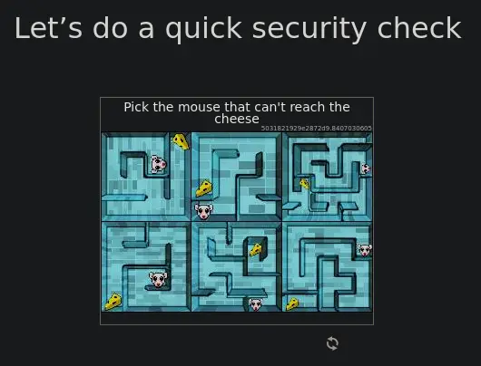
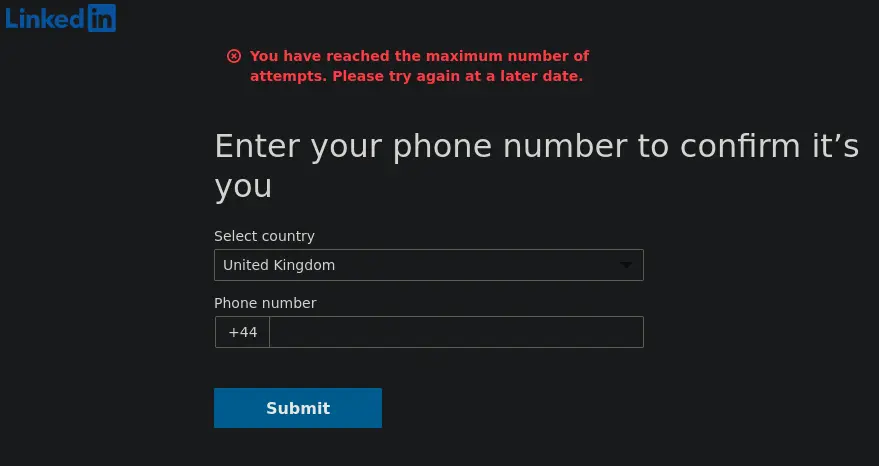

+++
date = '2025-02-06T17:17:05Z'
draft = true
title = 'LinkedIn purgatory and this website'
disableToc = true
series = 'Tech rants'
tags = ['Technology', 'Privacy', 'Cybersecurity', 'akll.org']
+++

TLDR: LinkedIn has randomly disabled my account, having prevented me
from logging in due to a broken login system, then demanded my
passport/driving licence to reinstate my account, before then blocking
me from even giving that to them anyway.

***

Greetings all, and welcome to the first post on this website—a website
born not of love, but of hate, vice, and spite.

Which is not to say that I haven't taken care in creating this
site. Quite the opposite, I intend to populate it with quality
writings. 

Quality writings such as these. 

Quality writings, the likes of which I am now unable to post on
LinkedIn, which has "temporarily restricted" my account. Hence
purgatory.

So why was it temporarily restricted I hear you ask? Well one day I
thought to connect my account with my university Outlook profile, and
then the next I was logged out of my account. Which happens, major
account changes tend to trigger such things for security—password
changes for example. Or if you're me and simply hated by the
algorithm, perhaps something so trite as having overly scruffy hair in
your picture. Who knows? They don't tell you because we are numbers on
a screen.

In any case the issue was attempting to log back in. Which required me
to fill in a dozen captchas, and surrender my phone number for
"verification" (the villains never even had my phone number before, in
what world does using one here verify anything?). And then, oh what a
surprise I just get taken back to the login screen.

But okay! I can handle terrible user experience, what else can you
expect? It's a Microsoft platform after all, that's simply the
norm. So I try again. And again. And lo! Failure. And worse, my
account is now gone from the interwebs and listed "temporarily
restricted". And now they demand my government-issue ID via a private
third party company to recover it. Which considering I already
verified via my university email address, is an obviously contrived
excuse to imbibe my personal data to be sold off to God knows where. I
never had my ID on here before, why should adding it now verify
anything? It is a malicious and insidious pattern which should quite
frankly be illegal (in fact it likely already is).

But I have better things to do, so I go off to do such better
things. I come back later and try again and now, my phone number is
rejected because the "maximum number of times" I can do this has been
exceeded. So I can't even verify myself even if I wanted to.

And do I want to? Absolutely not. To provide such documentation would
be a massive invasion of privacy. And how could anyone trust a company
which has already made its users victims to several data leaks in the
past [\[2012\]](https://en.wikipedia.org/wiki/2012_LinkedIn_hack)
[\[2023\]](https://cybernews.com/news/stolen-data-of-500-million-linkedin-users-being-sold-online-2-million-leaked-as-proof-2/)
[\[2024\]](https://www.linkedin.com/pulse/copy-urgent-notice-massive-data-leak-2024-26-billion-records-tugimin-ig1hc),
as well as having been subject to countless lawsuits
[\[2018\]](https://news.ycombinator.com/item?id=18525511)
[\[2023\]](https://news.ycombinator.com/item?id=38081633)
[\[2025\]](https://www.bbc.co.uk/news/articles/cdxevpzy3yko) regarding
user privacy and personal data? The last thing I need, is a crook with
a penchant for identity theft flaunting my passport around.

So, I'd like to delete my LinkedIn account completely. I don't
particularly find any value in its data mining practices and largely
obnoxious content. But to do that, I need to give them my ID to sign
back in so I can press the delete button. 

That or I take legal action via the ICO. Which as it stands seems to
be the way things are going to go. Thank you A-level Computer Science
for teaching me UK data privacy law.

Anyway. That's why I have this site now, which I have complete control
over and don't have to worry about suddenly locking me out. As a
bonus, doesn't take 30 seconds to load, no tracking, and no
adverts. Happy days.

For those interested in the technical details, the site is built using
[Hugo/Poison](https://themes.gohugo.io/themes/poison/), hosted on
GitHub Pages. Comments via [utteranc.es](https://utteranc.es). I do
recognise the irony of hosting my website on another Microsoft-owned
platform, but this one at least isn't a complete dumpster fire
(yet). I used to self-host on a Pi 3B+ (OpenBSD + httpd) but have
since gutted my server out for other projects during the 2020-2023
[chip
shortage](https://en.wikipedia.org/wiki/2020%E2%80%932023_global_chip_shortage).
